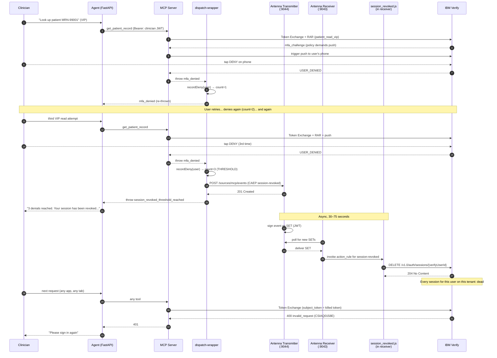

## SSF Architecture — Why and How

The base cookbook secures every *successful* call: clinician token in, RAR-attested OBO out, ephemeral PostgreSQL credential, one SELECT, lease revoked. This chapter is about the OTHER direction. What happens when a clinician is doing something they shouldn't — denying step-up MFA pushes for VIP charts they have no business reading? In this cookbook, three denials trip an automatic tenant-wide session revocation through the OpenID Shared Signals Framework. The mechanism is worth understanding before you stand it up, because the moving parts span four processes (MCP server, IBM Antenna transmitter, IBM Antenna receiver, IBM Verify SaaS) and one new wire format (the CAEP Security Event Token).

## What Shared Signals is

The OpenID **Shared Signals Framework** (SSF) is a small set of specifications that let security-relevant signals propagate between cooperating systems in real time. The signal we care about in this cookbook is one specific event type from the companion **Continuous Access Evaluation Protocol** (CAEP): `https://schemas.openid.net/secevent/caep/event-type/session-revoked`. Senders are called *transmitters*; recipients are called *receivers*. The wire format is a **Security Event Token** (SET) — a JWT carrying a structured event payload, signed by the transmitter so a receiver can verify provenance.

The protocol matters because, before SSF, "revoke this user's sessions everywhere" was a coordination problem with no standard answer. Every relying party had to poll the IdP. Or the IdP had to know every relying party's revocation API. Or you accepted that token TTLs were the upper bound on damage. SSF turns it into a publish/subscribe problem with a single shared event vocabulary. The MCP server publishes a `session-revoked` event into a local Antenna container; Antenna calls IBM Verify's `DELETE /v1.0/auth/sessions/{userId}` admin API; every session that user has on the tenant — this cookbook's app, the IBM Verify mobile app, any other OIDC app federated to the same tenant — is killed within ~30 to 75 seconds.

## What this cookbook adds

The base cookbook teaches the per-call security model. This chapter extends it with one additional path: a 3-strikes counter for MFA denials on VIP reads. The clinician trying to view a VIP chart gets a step-up MFA push (you saw this in chapter 10's smoke test). If they deny it, the MCP server increments a per-user counter. On the third consecutive denial, the MCP server emits a CAEP `session-revoked` event into the local Antenna transmitter; the transmitter signs it as a SET; the receiver polls the transmitter, picks up the SET, runs the `session_revoked.js` action handler, and the handler calls IBM Verify's session-revocation API. The user's next request to *any* federated app gets a 401.

Everything happens through standards. The clinician's identity is the same Verify JWT throughout. The event format is RFC 8417 + the CAEP profile. The delivery model is RFC 8936 (SSF poll-based SET delivery). The revocation API is IBM Verify's documented admin endpoint. No bespoke channels, no proprietary correlation ids, no secret handshakes.

## What's new in v26.03

The IBM Antenna 26.03 release is materially different from the 25.05 line that earlier customers learned. If you already operate 25.05 in production, read this section before you re-deploy — the deltas are small in line count but large in topology. Customers starting fresh can read it for context, then move on to chapter 14.

**Two images, one binary.** v25.05 ran the transmitter and receiver as separate top-level YAML sections inside a single container. v26.03 ships two container images (`ibm-verify-antenna-transmitter:26.03.0` and `ibm-verify-antenna-receiver:26.03.0`). The binary inside both images is identical; the image you pick is purely a packaging convention. Role is determined by which top-level YAML section (`transmitter:` vs `receiver:`) is present in the configs the container reads.

**Every YAML file requires `version: 26.03` as its first key.** A missing or mismatched version triggers `"No configuration to merge."` at startup with no further explanation.

**No more top-level `processor:` block.** The two halves of v25.05's `processor.yml` split into different homes. `transform_rules` are now per-source under `transmitter.ingester.sources[].transform_rule`. `action_rules` are now under `receiver.runtime.action_rules[]`. Anyone copy-pasting a v25.05 `processor.yml` into v26.03 will get a config that loads silently but does nothing.

**The stream-create endpoint moved from the transmitter to the receiver.** In v25.05 the stream was registered at `POST :9043/mgmt/v1.0/receivers/config` on the *transmitter*. In v26.03 it lives at `POST :9043/mgmt/v2.0/receivers/config` on the *receiver*. The receiver owns its own subscription and calls the transmitter on its own behalf. The body shape changed too — camelCase top-level fields (`metadataUrl`, `authorizationScheme`, `ssfStream`) replacing the v1 snake_case shape, and `additional_properties.poll_interval_in_seconds` is gone from the body entirely.

**Datastore is mandatory.** Each role declares its own set of databases (`config`, `raw_2_ssf`, `ssf_2_set`, `poll_stage` on the transmitter; `config`, `ssf_2_action` on the receiver). This cookbook keeps the datastore simple by declaring all five against a single SQLite `server_connection` per role — the recipe-mode upstream wires Postgres + Kafka for production. SQLite is enough for the laptop scenario.

**Mount path is `/configs`, not `/var/antenna/config`.** The binary unconditionally reads from `/configs`. The IBM `verify-antenna-recipes` repo's docker-compose has a verified bug that mounts at `/var/antenna/config`; using that path silently fails with "ERROR reading directory" at startup. The cookbook's `infra/docker-compose.yml` mounts at `/configs`.

## End-to-end sequence

The diagram below traces the full chain from a user denying their third MFA push to their next request returning 401. Read it once before you stand up the pieces; you'll come back to it whenever something in the chain misbehaves.



The crucial property of this picture: the synchronous reply to the user (steps 14–15) happens *before* the asynchronous Verify revocation (steps 18–21). The user knows their session is being revoked the moment the third denial registers, even though it takes Antenna another ~30 seconds to actually do the work. That matters because the user-visible message can't wait for the round trip — Antenna's poll cycle is bounded but not instantaneous.

## The canonical CAEP payload shape

The MCP server's `antenna-emitter.ts` constructs exactly one payload shape. Get any field wrong and Antenna will return a 201 from the ingester (the JSON parses), then silently persist the event as "unsigned" because downstream signing or delivery fails. The `session_revoked.js` action handler never fires. You get nothing visible to debug from — no error, no log entry, no failed Verify call. The shape must be exact.

```json
{
  "sub_id": {
    "format": "email",
    "verifyUserId": "643002NOIP",
    "email": "clinician@example.com"
  },
  "events": {
    "https://schemas.openid.net/secevent/caep/event-type/session-revoked": {
      "event_timestamp": 1748208000,
      "initiatingEntity": "policy",
      "reasonAdmin": { "en": "3 consecutive MFA denials on VIP read attempts" },
      "reasonUser":  { "en": "3 consecutive MFA denials on VIP read attempts" }
    }
  }
}
```

Three field-level gotchas worth their own callouts:

| Field | Common mistake | Correct |
|---|---|---|
| `event_timestamp` | Milliseconds (`Date.now()`) | **Seconds** (`Math.floor(Date.now() / 1000)`) |
| `initiatingEntity` | `initiator_entity` (snake_case) | `initiatingEntity` (camelCase) |
| `reasonAdmin` / `reasonUser` | A flat string (`"reason": "..."`) | A language-keyed dict (`{ "en": "..." }`) |

The `sub_id.verifyUserId` is the IBM Verify internal user id — the value the bearer's `sub` claim carries. The action handler reads it directly. If it's missing, the handler falls back to a SCIM email lookup, which adds latency and one more failure mode. The MCP server always populates it (decoded from the bearer in `bearer-claims.ts`).

## What the agent does NOT know about

The agent in this cookbook has no involvement in SSF. It does not emit CAEP events. It does not talk to Antenna. It does not know what a session-revoked event is. It has no Antenna URL hard-coded. When the threshold trips, the agent finds out the same way it finds out about any other tool error: the MCP server returns an error and the agent renders it. The wrapper at `mcp-server/src/ssf/dispatch-wrapper.ts` is the only new code in the entire request path between the agent and the tools, and the wrapper lives inside the MCP server.

This matches the cookbook's core argument that the MCP server is the security perimeter. Adding SSF did not require any change to the agent's interface with the MCP server — the wrapper sits *behind* the tool dispatch, transparently. The agent's only adaptation is a small client-side change: when it sees a tool result whose message contains the stable substring `"session has been revoked across all apps federated to this IBM Verify tenant"`, it raises `SessionRevokedError` and stops the agent loop. This is a known limitation of the MCP TypeScript SDK round-trip — the wrapper throws an `Error` with a custom `code` property, but the SDK serializes only the message text to the client, dropping the `code`. Substring matching on a stable phrase is the workaround. The marker phrase is documented in `agent/healthcare_agent/errors.py` so a developer who changes the wrapper's message text knows to update the marker too.

## What's next

Move on to [SSF Setup](./ssf-setup.md) to provision the Verify-side SSF management API client, generate certs, template configs from Vault, and bring up the two Antenna containers. The synthetic probe at the end of that chapter is the gold-standard test that the pipeline is healthy — if it passes, the demo walkthrough in chapter 15 will work end-to-end.
